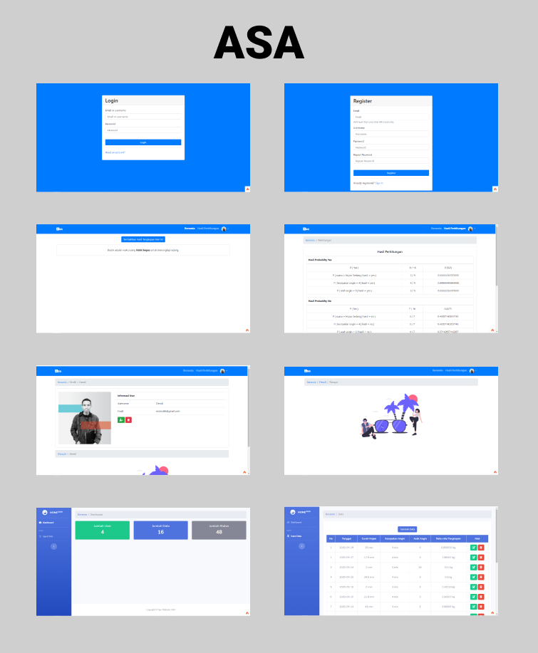
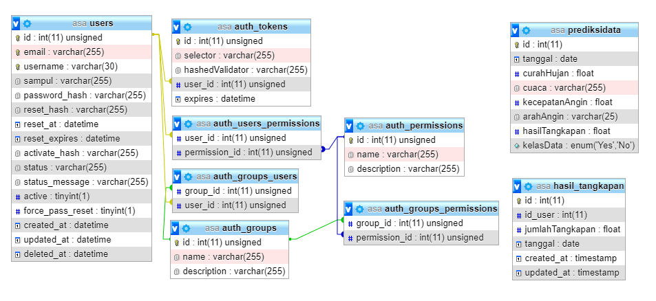

## ASA

Asa merupaka aplikasi yang di kembangkan demi kepentingan penyelesaian tugas data mining.
aplikasi ini di bangun menggunakan framework codeigniter 4, bootstrap sebagai framework css dan mysql sebagai database.

## Running

1. Import database dengan nama `ASA.sql`
2. Lakukan instalasi package dengan perintah `composer update`
3. Pindahkan folder `app/views/auth/views` ke folder `vendor/myth/auth/src`
4. Pindahkan folder `app/views/auth/filters` ke folder `vendor/myth/auth/src`
5. Pindahkan file `auth.php` pada folder `app/views/auth` ke folder `vendor/myth/auth/src/config`
6. Running dengan perintah `php spark serve`

## Interface

## Relasi Antar Tabel

---

## Terima Kasih
